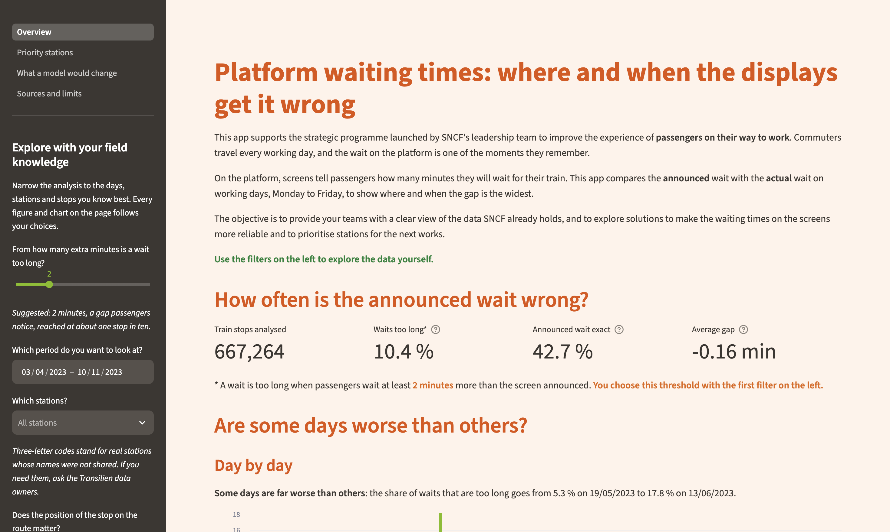

# SNCF platform waiting times

[](https://github.com/blanchemahe/sncf-waiting-time/actions/workflows/ci.yml)

A Streamlit app that compares the waiting time announced on platform screens with the actual waiting time, on the SNCF Transilien network. It shows where and when the screens get it wrong, and what a prediction model would change.

> **This is a student project.** The business context used in the app, an SNCF strategic programme and its teams, is a fictional scenario written for a course. The app is not an SNCF product. The data and the results are real.



The app has four pages:

| Page | Question it answers |
|---|---|
| Overview | How often is the announced wait wrong, and are some days worse than others? |
| Priority stations | Which stations make passengers wait longer than announced? |
| What a model would change | How much more accurate could the screens be, and where? |
| Sources and limits | Where does the data come from, and what can the analysis not tell? |

## Run the app with Docker

This is the quickest way: the image contains the app, the data and the trained model.

```bash
docker run --rm -p 8501:8501 blanchemahe/sncf-waiting-time
```

Then open <http://localhost:8501>. The image is published on [Docker Hub](https://hub.docker.com/r/blanchemahe/sncf-waiting-time) for both `linux/amd64` and `linux/arm64`, so it runs on Intel and Apple Silicon machines.

To build the image yourself instead:

```bash
git clone https://github.com/blanchemahe/sncf-waiting-time.git
cd sncf-waiting-time
docker build -t sncf-waiting-time .
docker run --rm -p 8501:8501 sncf-waiting-time
```

## Requirements

To run the project without Docker, you need [uv](https://docs.astral.sh/uv/), which manages Python and the dependencies.

```bash
git clone https://github.com/blanchemahe/sncf-waiting-time.git
cd sncf-waiting-time
uv sync
```

`uv sync` installs Python 3.12 and every dependency at the exact version recorded in `uv.lock`.

**On macOS**, the model relies on XGBoost, which needs the OpenMP runtime. It is a system library that uv cannot install, so install it once with [Homebrew](https://brew.sh/):

```bash
brew install libomp
```

This step is not needed with Docker: the image ships everything the app needs.

Then start the app:

```bash
uv run streamlit run app.py
```

## Training

The trained model is versioned in `models/waiting_time.json`, so the app runs without training anything. To train it again:

```bash
uv run python scripts/train_model.py
```

The script trains an XGBoost model on the first 73 days, saves it, and evaluates it on the 18 most recent days, which the model never sees during training. The random seed is fixed, so two runs give the same model.

## Evaluation

The same script prints the mean error of three ways to announce a wait, on the 18 days set aside:

```bash
uv run python scripts/train_model.py
```

To run the unit tests with their coverage:

```bash
uv run pytest --cov=sncf_waiting_time --cov-report=term-missing
```

The 53 tests cover the data loading, the filters, the summaries, the model variables and the model itself, with 100 % line coverage of the package. The CI fails below 90 %.

## Pre-trained model

| Model | File | Docker image |
|---|---|---|
| XGBoost, absolute error objective, 300 trees | [`models/waiting_time.json`](models/waiting_time.json) | [`blanchemahe/sncf-waiting-time`](https://hub.docker.com/r/blanchemahe/sncf-waiting-time) |

## Results

Mean error in minutes on the 18 days set aside (130,493 train stops, from 4 October to 10 November 2023):

| Method | Mean error | Change |
|---|---|---|
| Screens today, which announce the planned wait | 0.867 min | |
| Fixed correction per station, without any model | 0.742 min | −14 % |
| XGBoost model | 0.626 min | −28 % |

Reproduce these figures with `uv run python scripts/train_model.py`.

What the app shows on the full data set (667,264 train stops, 84 stations, 91 days):

- **The announced wait is exact for 43 % of the stops.** In 10 % of them, passengers wait at least 2 minutes longer than announced.
- **No day of the week stands out.** The share of long waits stays between 10.1 % and 10.7 % from Monday to Friday.
- **One station stands far above the rest.** At station `OML`, 79 % of the waits are at least 2 minutes longer than announced, against 10 % on average.
- **Half of the gain needs no model.** Shifting the announced wait of each station by its usual gap already removes 14 % of the error.
- **The station explains two thirds of what the model learnt.** The gap is mostly a property of the place, more than a delay travelling with the train.
- **Stations fall into two groups.** At some, the gap is predictable and the display can be corrected: at `OML` the model brings the error from 2.16 to 0.56 minute. At others, such as `ZFB`, even the model cannot anticipate the gap.

## Project structure

```
sncf-waiting-time/
├── app.py                    entry point of the app: data, filters, navigation
├── app_pages/                one file per page of the app
├── src/sncf_waiting_time/    the package, with all the logic
│   ├── data.py               load and merge the raw files
│   ├── filters.py            filter by station, date and stop rank
│   ├── summaries.py          key figures, daily and weekday summaries, ranking
│   ├── features.py           variables given to the model
│   └── model.py              training, prediction and evaluation
├── tests/                    unit tests, one file per module
├── scripts/train_model.py    reproducible training script
├── data/                     raw data, compressed
├── models/                   trained model
├── Dockerfile
├── pyproject.toml            dependencies and project settings
└── uv.lock                   exact version of every dependency
```

The app files only display: every computation lives in the package, where it is tested.

## Reproducibility

- **Dependencies** are locked in `uv.lock`, including transitive ones, and Python is pinned in `.python-version`.
- **The model** is trained with a fixed seed and versioned in the repository.
- **The Docker image** is built from the lock file, so it installs the same versions as a local setup.
- **The CI** runs on every pull request: Ruff for linting and formatting, the tests with their coverage, and a build of the Docker image. The `main` branch only accepts pull requests whose checks pass.
- **Pre-commit hooks** run Ruff before each commit. Install them with `uv run pre-commit install`.

## Data

The data was published by **SNCF-Transilien** on the [Challenge Data](https://challengedata.ens.fr/challenges/166) platform run by ENS, for challenge n°166, *Live prediction of platform waiting time*. It is reused here under the terms of that platform, which place the data under the Etalab Open Licence unless stated otherwise.

Each row is one train stopping at one station on one day. The measure is the gap, in whole minutes, between the announced wait and the actual wait. A negative gap means passengers waited longer than announced.

## Limits

1. **Stations and trains are anonymised.** Stations appear as three-letter codes, and the list of names was not published. With it, the analysis would be far more useful: real names and a map.
2. **There is no time of day**, only the date of each stop.
3. **Only working days are covered**, Monday to Friday, outside July and August: 91 days between 3 April and 10 November 2023.
4. **The model is judged on 18 days.** The official test set of the challenge has no answers, so the most recent days of the training set are set aside instead.
5. **The model is a short-term tool.** It corrects the announced wait for a train two stations away. It does not forecast which stations will go wrong later.
6. **The app shows where the screens are wrong, not why.**

## Contributing

Each change follows the same path: an issue, a branch created from the issue, a pull request, and a merge once the CI passes.

## Credits and licence

The analysis and the model come from a group project in machine learning, on the same data challenge. This app, its tests, its CI and its Docker image were built by Blanche Mahé for the course *Tooling for the Data Scientist*. The model used here is a single XGBoost model, simpler than the one of the original project.

The code is released under the [MIT licence](LICENSE). The data remains under the licence of its publisher.
